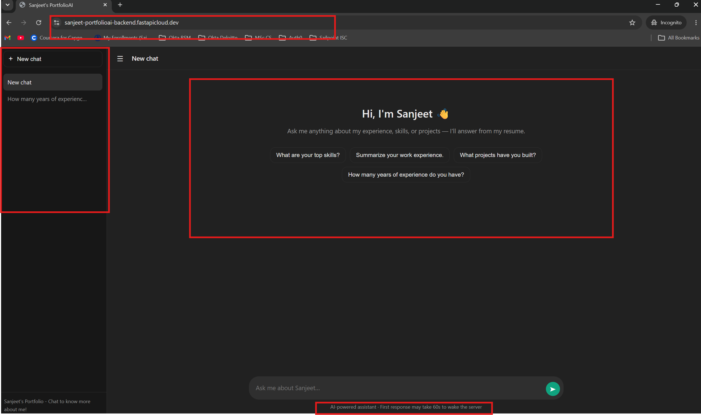

# Resume AI — Chat with Sanjeet's Portfolio



An AI-powered chatbot that lets recruiters and hiring managers ask questions about my resume and receive instant, accurate answers — as if they were interviewing me directly.

**[🔗 Live Demo](https://sanjeet-portfolioai-backend.fastapicloud.dev)**

---

## 📋 Table of Contents

- [Features](#-features)
- [Architecture](#️-architecture)
- [Tech Stack](#️-tech-stack)
- [Project Structure](#-project-structure)
- [How It Works](#-how-it-works)
- [Running Locally](#️-running-locally)
- [API Endpoints](#-api-endpoints)
- [Deployment](#-deployment)
- [Configuration](#️-configuration)
- [Security Notes](#-security-notes)
- [Troubleshooting](#-troubleshooting)
- [License](#-license)
- [Contact](#-contact)

---

## ✨ Features

- **Conversational Q&A** — Ask anything about my experience, skills, or projects
- **Streaming responses** — Answers appear word-by-word, just like ChatGPT
- **Smart resume parsing** — Uses an LLM to extract structured data from a PDF resume
- **Chat history** — Multiple conversations saved in the browser (localStorage)
- **New chat / delete chat** — Full conversation management in the sidebar
- **Markdown rendering** — Bold, lists, and code blocks render properly
- **Cold-start handling** — Friendly status messages ("Waking up the server…") while the free tier spins up
- **Mobile responsive** — Works on desktop, tablet, and phone
- **Single-origin deployment** — Frontend and backend served from the same FastAPI app (no CORS needed)

---

## 🏗️ Architecture

```
┌─────────────────┐         ┌──────────────────────┐
│   Browser       │  HTTP   │   FastAPI (backend)  │
│   (frontend)    ├────────►│   main.py            │
│                 │         │                      │
│  • Chat UI      │         │  • /chat             │
│  • localStorage │         │  • /chat/stream      │
│  • Streaming    │         │  • /static/*         │
└─────────────────┘         └──────────┬───────────┘
                                       │
                                       ▼
                            ┌──────────────────────┐
                            │   SenseNova API      │
                            │   (LLM Provider)     │
                            └──────────────────────┘
```

The frontend and backend are served from the **same origin**, so no CORS configuration is required.

---

## 🛠️ Tech Stack

### Backend
- **Python 3.13**
- **FastAPI** — web framework
- **OpenAI SDK** — OpenAI-compatible client for SenseNova
- **Pydantic** — data validation and resume schema
- **pypdf** — PDF text extraction
- **python-dotenv** — environment variable loading
- **uv** — fast Python package manager

### Frontend
- **Vanilla HTML / CSS / JavaScript** — no framework, no build step
- **marked.js** — markdown rendering
- **localStorage** — client-side chat persistence

### AI Model
- **SenseNova 6.8 Flash Lite** via `token.sensenova.ai`

### Deployment
- **FastAPI Cloud** — free tier, no credit card required
- **GitHub** — source control

---

## 📁 Project Structure

```
portfolioai/
├── backend/
│   ├── main.py                 # FastAPI app — all routes and logic
│   ├── requirements.txt        # Python dependencies
│   ├── sanjeet_resume.pdf      # Source resume (parsed by the LLM)
│   └── .env                    # API keys (not committed)
├── frontend/
│   ├── index.html              # Chat UI markup
│   ├── style.css               # Dark theme styling
│   └── app.js                  # Chat logic, streaming, localStorage
├── screenshots/
│   └── chat-ui.png             # Screenshot of the running app
├── .gitignore
├── pyproject.toml
├── uv.lock
└── README.md
```

---

## 🧠 How It Works

### 1. Resume Parsing (once, cached)
On startup, `get_resume()` reads the PDF, sends its text to the LLM along with a JSON schema, and receives a structured `Resume` object. The result is cached with `@lru_cache` so it's only parsed once — not on every question. This is the single biggest performance optimization in the app.

### 2. Question Answering
When a question arrives:

1. The parsed `Resume` is serialized into the system prompt
2. The user's question is appended
3. SenseNova generates an answer using **only** the resume data
4. Tokens stream back to the browser in real time via `/chat/stream`

### 3. Frontend
The UI mirrors ChatGPT:

- **Sidebar** — chat history with new/delete buttons
- **Message area** — markdown rendering with streaming token updates
- **Composer** — auto-growing textarea with Enter-to-send
- **Status messages** — during cold starts, shows "Waking up the server…" with a pulsing animation
- **Persistence** — chats stored in `localStorage`, survive page reloads

---

## 🖥️ Running Locally

### Prerequisites

- Python 3.11+
- [uv](https://github.com/astral-sh/uv) (recommended) or pip
- A SenseNova API key from [platform.sensenova.cn](https://platform.sensenova.cn)

### Steps

1. **Clone the repo**

   ```bash
   git clone https://github.com/SANJEET091/portfolioai.git
   cd portfolioai
   ```

2. **Install dependencies**

   ```bash
   uv sync
   ```

3. **Create `.env` in `backend/`**

   ```
   SENSE_NOVA_API_KEY=sk-your-key-here
   ```

4. **Add your resume**

   Place your PDF at `backend/sanjeet_resume.pdf` (or update the path in `main.py`).

5. **Run the server**

   ```bash
   cd backend
   uv run uvicorn main:app --reload
   ```

6. **Open the app**

   Visit [http://127.0.0.1:8000](http://127.0.0.1:8000)

---

## 🔌 API Endpoints

| Method | Endpoint | Description |
| :--- | :--- | :--- |
| `GET` | `/` | Serves the chat UI |
| `POST` | `/chat` | Non-streaming Q&A — returns `{"answer": "..."}` |
| `POST` | `/chat/stream` | Streaming Q&A — returns plain text tokens |
| `GET` | `/docs` | Auto-generated Swagger UI |
| `GET` | `/static/*` | Static frontend assets (CSS, JS) |

### Example: Non-Streaming Request

```bash
curl -X POST https://sanjeet-portfolioai-backend.fastapicloud.dev/chat \
  -H "Content-Type: application/json" \
  -d '{"question": "What are your top skills?"}'
```

**Response:**

```json
{
  "answer": "Thank you for the question. My top skills are centered around Identity and Access Management (IAM) and Cybersecurity..."
}
```

### Example: Streaming Request (JavaScript)

```javascript
const res = await fetch("/chat/stream", {
  method: "POST",
  headers: { "Content-Type": "application/json" },
  body: JSON.stringify({ question: "What are your top skills?" }),
});

const reader = res.body.getReader();
const decoder = new TextDecoder();

while (true) {
  const { done, value } = await reader.read();
  if (done) break;
  process.stdout.write(decoder.decode(value, { stream: true }));
}
```

---

## 📦 Deployment

The app is deployed on **FastAPI Cloud** (free tier, no credit card required):

1. Push the repo to GitHub
2. Sign up at [fastapicloud.com](https://fastapicloud.com)
3. Connect the GitHub repo
4. Add `SENSE_NOVA_API_KEY` as an environment variable
5. Deploy

FastAPI Cloud builds and hosts both the API and the static frontend from the same repo.

### Free Tier Notes

- The app **sleeps after inactivity** on the free tier
- The **first request after a sleep takes 30–50 seconds** to wake the server
- Subsequent requests are fast (2–5 seconds)
- The UI shows "Waking up the server…" during the cold start so the wait feels intentional

To avoid cold starts, use a free uptime monitor like [UptimeRobot](https://uptimerobot.com) to ping the URL every 5 minutes.

---

## ⚙️ Configuration

### Environment Variables

| Variable | Description | Required |
| :--- | :--- | :--- |
| `SENSE_NOVA_API_KEY` | API key for SenseNova | ✅ Yes |

### Model Configuration

In `backend/main.py`:

```python
model = "sensenova-6.8-flash-lite"
```

Other models available on the SenseNova Token Plan:

- `sensenova-6.7-flash-lite`
- `deepseek-v4-flash`
- `glm-5.2`

### Resume Path

The resume PDF path is defined in `get_resume()`:

```python
pdf_path = BASE_DIR / "backend" / "sanjeet_resume.pdf"
```

Update this if you move the PDF.

---

## 🔒 Security Notes

- The `.env` file is **not** committed — API keys are managed via environment variables
- On FastAPI Cloud, `SENSE_NOVA_API_KEY` is stored in the encrypted secrets vault
- The backend never exposes the raw resume; it only answers questions in natural language
- Resume parsing uses an LLM but the result is cached and never sent to the client
- CORS is not needed because the frontend and backend share the same origin

---

## 🐛 Troubleshooting

| Issue | Cause | Fix |
| :--- | :--- | :--- |
| `SENSE_NOVA_API_KEY not found in .env` | Env var not set | Add it in the FastAPI Cloud dashboard |
| `JSONDecodeError` during parsing | Model returned non-JSON | Ensure `extract_json()` strips markdown fences |
| `RuntimeError: Directory 'frontend' does not exist` | Wrong relative path | Use `BASE_DIR / "frontend"` with `Path(__file__)` |
| `404 page not found` on the API | `base_url` has extra `/chat/completions` | Set `base_url` to `https://token.sensenova.ai/v1` |
| First request takes 30–50s | Cold start on free tier | Expected — use UptimeRobot to keep it warm |
| Stream crashes with empty chunk | First chunk has empty `choices` | Guard: `if not chunk.choices: continue` |
| Slow responses | Resume re-parsed on every message | Add `@lru_cache` to `get_resume()` |

---

## 📜 License

This project is open-source and available under the [MIT License](https://opensource.org/licenses/MIT).

---

## 📬 Contact

**Sanjeet Kr Ranjan**

- GitHub: [@SANJEET091](https://github.com/SANJEET091)
- Live demo: [sanjeet-portfolioai-backend.fastapicloud.dev](https://sanjeet-portfolioai-backend.fastapicloud.dev)

---

⭐ If you found this project useful or interesting, feel free to star the repo!